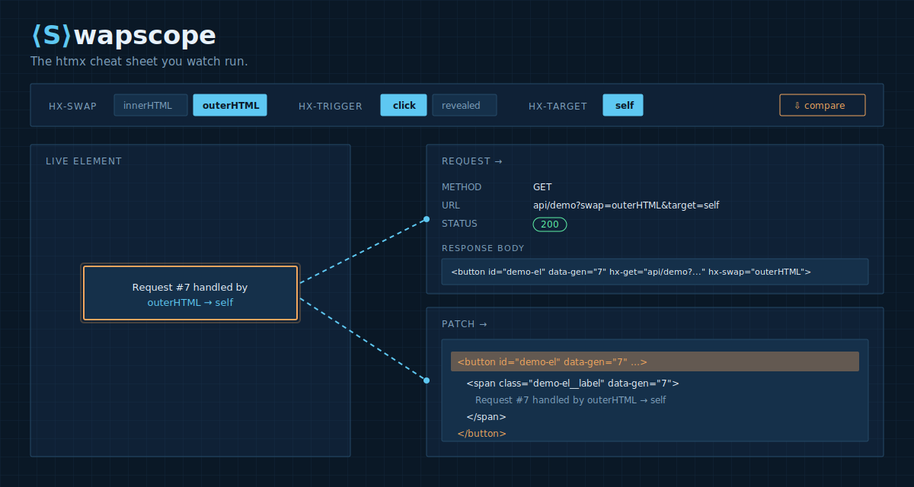

# Swapscope

**▶ Live demo: [apps.charliekrug.com/attribute-lab](https://apps.charliekrug.com/attribute-lab/)**

The htmx cheat sheet you watch run. Click an `hx-*` attribute preset on a live demo
element and watch the actual network request and the resulting DOM patch fire in sync,
side by side. Not a table you read: a machine you watch run.

[](https://github.com/ctkrug/attribute-lab/actions/workflows/ci.yml)
[](LICENSE)



## Who it's for

Developers learning htmx who would rather see an attribute fire than read a paragraph
about it. htmx's whole pitch is "attributes drive behavior," but every reference for it
is static prose: a table of attribute names next to a one-line description. You end up
reading about `hx-swap="outerHTML"` without ever seeing what "outer" actually replaces
versus `innerHTML`. Swapscope closes that gap. Pick a preset, watch the wire, watch the DOM.

## The wow moment

Toggle `hx-swap` from `innerHTML` to `outerHTML` on a live button. The request panel
fires the real HTTP call htmx made (method, headers, response body). At the same instant,
the exact DOM node(s) that got replaced flash-highlight in the live element pane, so the
difference between "replace what's inside" and "replace the whole element" is something
you see happen, not something you infer from a paragraph. Flip on compare mode to run both
swap strategies at once, side by side.

## What you can drive

- **`hx-swap`** toggle (`innerHTML` vs `outerHTML`): the wow moment.
- **`hx-trigger`** presets: `click`, `revealed`, and a `click delay:500ms` modifier.
- **`hx-target`**: swap the element itself or an external destination.
- **`hx-select`**: filter a fragment down to `[data-fragment-content]` before the swap,
  with the unfiltered response still shown in the network panel.
- **`hx-indicator`**: watch the loading state land and clear during a held response.
- **Compare mode**: fire one trigger against two swap strategies at once, each lab
  instrumented independently from the same real htmx event stream.
- **Shareable links**: the full preset state is encoded in the URL, so a copied link
  reproduces the exact demo.

## How it works

- A small **Go** server exposes the `api/demo` endpoint, returning htmx-flavored HTML
  fragments (the same kind of responses a real htmx backend would send). It runs under
  `make run`. In production, published as static files with no Go runtime, a **service
  worker** (`static/sw.js`) answers the same `api/demo` requests in the browser from a
  byte-for-byte JS port of the Go renderer, so htmx still makes a real request against a
  real response and the network panel is never a mock. A golden manifest test keeps the
  two backends identical.
- The frontend is plain **HTMX** wired to a live demo element. A lightweight
  instrumentation layer taps `htmx:configRequest` / `htmx:afterRequest` / `htmx:afterSwap`
  to drive two synced panels:
  - **Network panel**: method, URL, request headers, response status, response headers,
    response body.
  - **DOM patch panel**: the live element, with swapped nodes flash-highlighted the
    instant the swap lands.
- Presets are just attribute combinations applied to the demo element via a toggle UI, no
  code editing required.

## Run it

```
make run           # builds bin/attribute-lab and starts it on :8080
PORT=8090 make run # or pick a port explicitly
make test          # go test -race ./... + node --test static/js/*.test.mjs
make site          # assemble the static deploy bundle in site/
```

No database, no build step for the frontend: `static/` is embedded straight into the
binary via `go:embed`, so `make run` needs nothing beyond a Go toolchain. `make test`
additionally needs Node. `test-js` runs `npm install` on first use (dev-only: fast-check
for property tests and jsdom for the DOM smoke tests; nothing ships in the binary).

## Stack

- **Backend:** Go (`net/http`, stdlib) serving the htmx fragment endpoint and the static
  frontend for self-host. On the static CDN deploy a root-scoped service worker serves the
  same fragments in-browser from a JS port of the Go renderer, golden-tested for byte parity.
- **Frontend:** HTMX + vanilla JS/CSS. No framework, no build step required to run.
- **Tests:** Go's `testing` package (with `-race`) for handler and fragment behavior, plus
  `node --test`: fast-check property tests for the pure instrumentation helpers and jsdom
  smoke tests for the DOM glue.

## Docs

- [`docs/ARCHITECTURE.md`](docs/ARCHITECTURE.md): how the pieces fit together.
- [`docs/VISION.md`](docs/VISION.md): the full design and rationale.
- [`docs/DESIGN.md`](docs/DESIGN.md): the blueprint visual direction and tokens.
- [`docs/BACKLOG.md`](docs/BACKLOG.md): what shipped and what's next.

## License

MIT, see [`LICENSE`](LICENSE).

---

More of Charlie's projects → [apps.charliekrug.com](https://apps.charliekrug.com)
